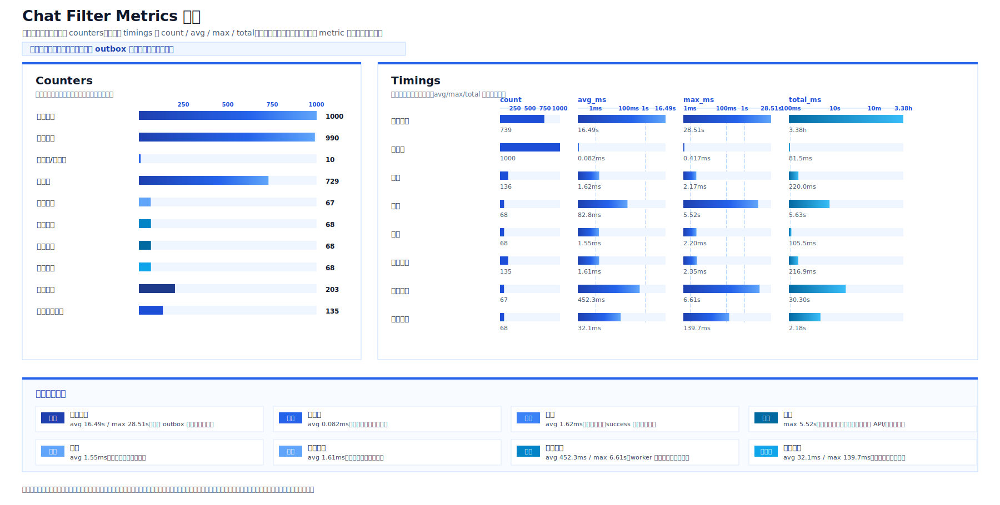

# Chat Filter

AstrBot 群聊过滤插件。插件会在群消息中检测违禁词和正则规则，命中后可提示、阻断后续处理、禁言、撤回，并把命中消息转发到指定推送群。

## 功能

- 群消息过滤：支持全局规则和每群自定义词。
- 普通词抗绕过：默认允许词内插入少量字符仍命中，例如通过 `obfuscated_word_max_gap` 控制间隔。
- SQLite 规则存储：违禁词和正则规则以 `global_rules` 为准，不从 JSON 配置读取词库。
- 正则规则：支持 `{{GAP}}` 占位符，由 `regex_gap_max` 控制展开后的最大间隔。
- 每群启停：可单独开启或关闭某个群的过滤。
- 群主/管理员豁免：每个群独立开关，默认开启；关闭后群主和管理员也会被检测。
- 违规处置：命中后可警告用户、阻断事件、禁言、撤回消息。
- 动作策略：可按群切换禁言、撤回、转发，并支持仅审计模式。
- 命中转发：可把监听群命中消息转发到一个或多个推送群。
- 禁言策略：支持每群设置基础禁言时长，并按连续命中叠加禁言。
- 审计报表：命中记录写入 SQLite，可手动生成 TSV dry-run 报表。
- 正则诊断：可查看被跳过的正则规则及原因，便于管理员修正规则。
- 平台探针：提供转发消息和文件发送探针，便于调试平台适配能力。

## 指令

以下示例使用 `.cf`。插件仅保留 `cf` 命令入口，避免重复前缀注册到同一批功能。
显式传入群号的指令不依赖当前消息所在群，可在私聊或任意有机器人的群聊发送；省略群号时才使用当前群，因此需要在群聊中发送。

| 指令 | 说明 |
| --- | --- |
| `.cf help` | 查看插件命令摘要。 |
| `.cf status` | 查看全局词数量和已记录群数量。 |
| `.cf overview` | 查看当前平台已启用过滤群、监听群和推送绑定数量摘要。 |
| `.cf overview csv` | 以 CSV 格式列出当前平台启用过滤的群，以及监听群绑定的推送群。 |
| `.cf regex-skips [数量]` | 查看启动时被跳过的正则规则及原因；仅 AstrBot 管理员可用。 |
| `.cf enable [群号]` | 启用当前群或指定群过滤；不再作为全局开关。传入其它群号时只允许 AstrBot 管理员使用。 |
| `.cf disable [群号]` | 关闭当前群或指定群过滤；不再作为全局开关。传入其它群号时只允许 AstrBot 管理员使用。 |
| `.cf group status` | 查看当前群过滤状态、继承状态、管理员豁免状态和群自定义词数量。 |
| `.cf group enable` | 启用当前群过滤。 |
| `.cf group disable` | 关闭当前群过滤。 |
| `.cf group add <词>` | 给当前群添加自定义过滤词。 |
| `.cf group add-to <群号> <词1,词2,...>` | 给指定群添加一个或多个自定义过滤词；仅 AstrBot 管理员可用。 |
| `.cf group remove <词1,词2,...>` | 从当前群移除一个或多个自定义过滤词。 |
| `.cf group remove-to <群号> <词1,词2,...>` | 从指定群移除一个或多个自定义过滤词；仅 AstrBot 管理员可用。 |
| `.cf group list` | 查看当前群自定义词数量。 |
| `.cf group bypass-add <群号> <词1,词2,...>` | 当前群或指定群绕过一个或多个全局普通词；命中这些短语的全局正则片段也会跳过。 |
| `.cf group bypass-remove [群号] <词1,词2,...>` | 移除当前群或指定群的全局普通词绕过项。 |
| `.cf group bypass-list [群号]` | 查看当前群或指定群全局普通词绕过数量。 |
| `.cf group admin-exempt status` | 查看当前群群主/管理员豁免开关。 |
| `.cf group admin-exempt enable` | 开启当前群群主/管理员豁免。 |
| `.cf group admin-exempt disable` | 关闭当前群群主/管理员豁免。 |
| `.cf group exempt status|enable|disable` | `admin-exempt` 的短别名。 |
| `.cf action status [群号]` | 查看当前群或指定群的处置动作策略。 |
| `.cf action mute [群号] on|off` | 开启或关闭指定群命中后的禁言动作；省略群号时作用于当前群。 |
| `.cf action recall [群号] on|off` | 开启或关闭指定群命中后的撤回动作；省略群号时作用于当前群。 |
| `.cf action forward [群号] on|off` | 开启或关闭指定群命中后的推送动作；省略群号时作用于当前群。 |
| `.cf action mode [群号] strict|audit` | 设置指定群处置模式；`audit` 只审计和推送，不禁言、不撤回。 |
| `.cf action overview [csv]` | 查看当前平台已知群的处置动作策略。 |
| `.cf bind <监听群> <推送群>` | 为监听群添加命中消息推送群。 |
| `.cf bind list` | 查看当前平台的推送绑定列表。 |
| `.cf mute <群号> <秒数>` | 设置指定群命中后的基础禁言时长。 |
| `.cf mute list` | 查看当前平台的群禁言策略。 |
| `.cf mute-stack <群号> <倍率> <重置秒数>` | 设置连续命中禁言叠加策略。 |
| `.cf mute-stack list` | 查看当前平台的禁言叠加策略。 |
| `.cf probe` | 查看当前平台动作能力探针。 |
| `.cf forward-probe [群号]` | 向指定群或当前群发送合并转发探针。 |
| `.cf file-probe [群号]` | 向指定群或当前群发送文件探针。 |
| `.cf report-dry-run [群号] [天数]` | 生成指定群命中历史 TSV 报表；未传群号时使用当前群。 |

## 权限

- 默认情况下，命令允许 AstrBot 管理员、QQ群主或 QQ 群管理员使用。
- `.cf enable [群号]` 和 `.cf disable [群号]` 修改当前群时允许 AstrBot 管理员或当前群群主/管理员；修改其它群时只允许 AstrBot 管理员。
- `.cf group add-to <群号> <词1,词2,...>` 只允许 AstrBot 管理员使用；当前群群主或管理员可继续使用 `.cf group add <词>`。
- `.cf group remove-to <群号> <词1,词2,...>` 只允许 AstrBot 管理员使用；当前群群主或管理员可继续使用 `.cf group remove <词>`。
- `.cf group bypass-add <群号> <词1,词2,...>`、`.cf group bypass-remove [群号] <词1,词2,...>` 和 `.cf group bypass-list [群号]` 修改或查看当前群时允许 AstrBot 管理员或当前群群主/管理员；传入其它群号时只允许 AstrBot 管理员。
- `.cf regex-skips` 只允许 AstrBot 管理员使用。
- `.cf action ...` 修改当前群时允许 AstrBot 管理员或当前群群主/管理员；修改指定群号时只允许 AstrBot 管理员。
- 权限判断依赖 AstrBot 配置中的管理员 ID 和平台事件中的群角色信息，不信任消息文本中的自称身份。

## 配置

插件配置来自 AstrBot 的 `_conf_schema.json`：

| 配置项 | 默认值 | 说明 |
| --- | --- | --- |
| `case_sensitive` | `false` | 是否区分大小写。 |
| `obfuscated_word_matching_enabled` | `true` | 是否启用普通词抗绕过匹配。 |
| `obfuscated_word_max_gap` | `4` | 普通词相邻字符最大间隔。 |
| `regex_gap_max` | `8` | 正则规则 `{{GAP}}` 占位符展开后的最大间隔。 |
| `stop_event` | `true` | 命中后是否阻断后续事件处理。 |
| `warn_user` | `true` | 命中后是否发送纯文本提示；插件不会主动 @ 用户。 |
| `warning_message` | `消息触发聊天过滤策略，请调整后重试。` | 命中后的纯文本提示文案。 |
| `max_word_count` | `500` | 每个词库最多词条数。 |
| `max_word_length` | `64` | 单个词条最大长度。 |
| `violation_records_enabled` | `true` | 是否写入 SQLite 命中审计记录。 |
| `mute_duration_seconds` | `600` | 默认基础禁言时长。 |
| `mute_escalation_multiplier` | `2` | 默认连续命中禁言叠加倍率。 |
| `mute_escalation_reset_seconds` | `3600` | 连续命中状态重置时间。 |
| `default_report_days` | `7` | 报表默认统计天数。 |

## 数据存储

- 主数据库：`data/astrbot_plugin_chat_filter/chat_filter.db`
- 全局规则表：`global_rules`
- 群策略、推送绑定、禁言策略和命中记录也存储在 SQLite。
- 群级自定义词存储在 `group_words`；群级全局普通词绕过项存储在 `group_bypass_words`。
- 群动作策略存储在 SQLite，scope 为 `platform + group_id`；未配置的群默认 `strict` 且禁言、撤回、转发全开。
- 运行时 JSON 配置只保存功能开关和安全参数，不保存违禁词或正则规则。
- 手动报表输出到插件数据目录下的 `reports/`。
- 文件探针输出到插件数据目录下的 `probes/`。

## 适配说明

- `aiocqhttp` 平台会优先使用 OneBot V11 action client 执行禁言、撤回、转发和文件发送。
- 非 OneBot 或能力不可用的平台会返回 unsupported/failed 状态，过滤检测本身仍可运行。
- 命中消息转发依赖 `.cf bind` 配置的推送群；没有绑定时只记录未调度状态。
- 正则规则跳过原因包括 `empty`、`too_long`、`duplicate`、`high_risk`、`compile_error`、`max_count`、`non_string`。

## 压测 Metrics 快照

以下图表来自一次 1000 个入口事件的运行中 metrics 快照，覆盖 counters、timing 样本数、平均耗时、最大耗时和累计耗时。耗时类图表使用对数刻度，避免低毫秒指标在图中不可见。



### 读图结论

- 本次样本中，用户确认 990 条为真实群消息，10 条为非消息事件；`message.unmatched.total` 不应直接理解为 10 条真实聊天文本未命中。
- `message.matcher.ms` 平均仅 0.082ms，说明关键词和规则匹配不是当前瓶颈。
- `message.handle_group_message.total` 为 1000，但 `message.handle_group_message.ms` 只记录到 739 个样本；同时 `message.matched.total` 为 990，而 `violation_job.enqueued.total` 为 729。两组差值都是 261，说明抓取快照时仍有 261 个命中入口在等待入队完成。
- `violation_job.enqueued.total` 为 729，而 `violation_job.completed.total` 为 67，说明这是压测过程中的中间状态，不是 outbox 队列排空后的最终吞吐结果。
- 撤回、转发和文本日志动作基本在 1-2ms 级别；禁言动作出现过 5.52s 尖峰，但平均 82.79ms，不是当前最大平均瓶颈。

### 建议

- 将命中后的入口返回与违规任务持久化入队解耦，避免 `stop_event` 等待 SQLite 入队完成后才返回。
- 补充 `violation_job.enqueue.ms`、`violation_job.enqueue_lock_wait.ms`、`violation_outbox.pending.count`、`violation_outbox.processing.count` 和 `oldest_pending_age_ms`，让下一轮压测能直接定位入队等待、锁等待和队列积压。
- 将非文本事件、空文本事件和真实文本未命中拆成不同 counters，避免 `message.unmatched.total` 被误读。
- 拆分 `violation_action.forward.success.total` 的语义，例如区分 per-target delivery success 与 aggregate forward success，避免把转发目标数误读为违规消息数。
- 若继续压测突发流量，评估 SQLite WAL、写入批处理或单 writer 队列；生产前不要只靠增加 worker 数解决，因为连续禁言升级需要关注同一群/同一用户的顺序一致性。

### 当前问题

- 入口平均耗时约 16.49s，最大约 28.51s，不适合作为性能合格指标。
- 当前快照缺少 p50、p95、p99，无法判断大多数消息的真实体验分布。
- 快照抓取时 outbox 未排空，不能代表最终处理完成率。
- 当前 metrics 可以作为诊断样本放入 README，但不应写成“压测通过”或“性能达标”。

## 运行要求

- Python: `>=3.10`
- AstrBot: `>=4.16,<5`
- 运行时第三方依赖：无

## 开发验证

```powershell
py -3.13 -B -m unittest discover -s . -p "test_*.py"
git diff --check
```

## License

MIT
